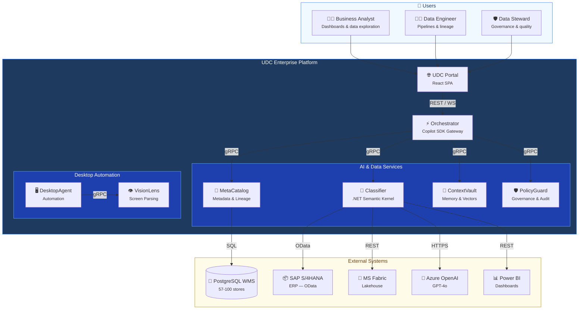
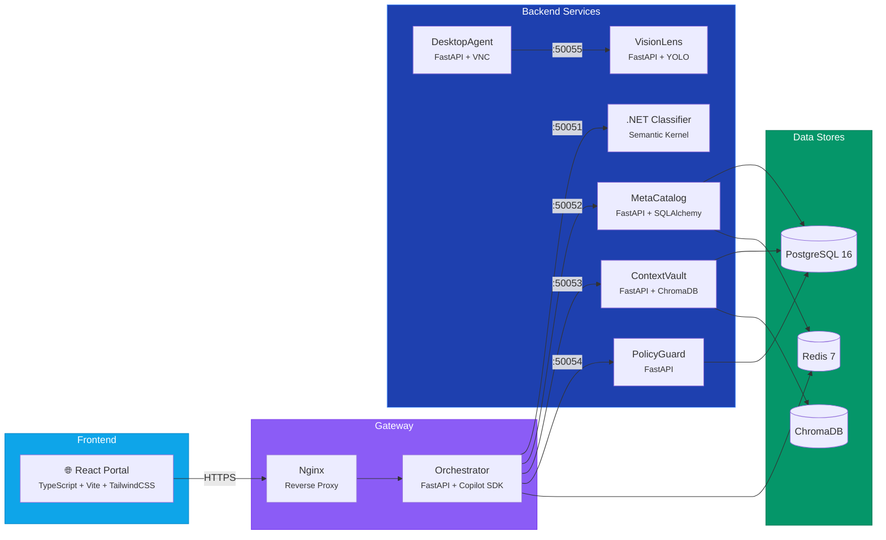

# UDC Enterprise Platform

### Generative UI for Universal Data Classification

[](https://github.com/NormanMul/GenerativeUIDataClassifier/actions/workflows/ci.yml)
[](https://github.com/NormanMul/GenerativeUIDataClassifier/actions/workflows/codeql.yml)
[](LICENSE)
[](https://python.org)
[](https://dotnet.microsoft.com)
[](https://react.dev)

A production-grade enterprise data management platform that uses **Generative AI** to automatically classify, catalog, govern, and visualize data across heterogeneous sources — PostgreSQL, SAP S/4HANA, and Microsoft Fabric Lakehouse.

> **Built for**: Retail enterprises with 57–100+ stores managing data across multiple systems.  
> **Key Innovation**: Natural-language-driven dashboard generation, automated PII detection, and AI-powered data classification — no SQL or BI expertise required.

---

## Why UDC?

| Challenge | How UDC Solves It |
|---|---|
| **Data scattered across 100+ databases** | Unified metadata catalog with auto-discovery across PostgreSQL, SAP, and Fabric |
| **Manual data classification is slow** | AI-powered classification using Semantic Kernel + GPT-4o — classifies thousands of columns in minutes |
| **Business users can't build dashboards** | Natural language → interactive dashboards: just describe what you want in plain English |
| **No visibility into data lineage** | Automatic lineage tracking from source → transformation → destination with D3.js visualization |
| **PII compliance is a nightmare** | Automated PII detection, policy enforcement, trust scoring, and full audit trail |
| **Data quality is inconsistent** | Continuous quality scoring (completeness, accuracy, timeliness) with configurable quality gates |

---

## Live Demo (No Dependencies Required)

Try the platform instantly with the built-in demo — no database, no Azure subscription, no configuration needed:

```bash
# 1. Install (just 2 packages)
pip install fastapi uvicorn

# 2. Run
python demo/mock_backend.py

# 3. Open browser
# http://localhost:8006/demo
```

This launches a fully interactive demo with:
- **55 data assets** (50 PostgreSQL WMS + 2 SAP + 3 Fabric) with realistic retail data
- **Dashboard Builder** — type a prompt, see Chart.js visualizations generated instantly
- **Data Catalog** — searchable, filterable, with column-level PII classification
- **Governance Center** — policies, audit trail, trust scores
- **AI Chat** — ask questions about your data in natural language

<details>
<summary><b>Screenshot: Dashboard Builder generating a Sales Performance Dashboard</b></summary>

After typing "Show me sales by region" and clicking Generate, the platform produces:
- Bar chart: Total Revenue by Region (Jakarta, Surabaya, Bandung...)
- Line chart: Monthly Sales Trend (Jan–Dec)
- Bar chart: Top 10 Stores by Revenue
- KPI Card: Revenue + Store Count with trend indicators
- Doughnut chart: Sales by Product Category
- Line chart: Average Order Value Trend

All charts are interactive (hover for tooltips, click for details).
</details>

---

## Architecture

### System Context



### Container Diagram



### Subsystems

| # | Subsystem | Stack | Purpose |
|---|-----------|-------|---------|
| Core | **UDC Classifier** | .NET 8 / Semantic Kernel | AI orchestration — agents, skills, data connectors |
| 1 | **UDC MetaCatalog** | Python / FastAPI / SQLAlchemy | Metadata catalog, lineage, data quality, glossary |
| 2 | **UDC ContextVault** | Python / FastAPI / ChromaDB | Tiered context memory (L0/L1/L2) for AI agents |
| 3 | **UDC VisionLens** | Python / FastAPI / YOLO | Screen parsing, UI element detection, OCR |
| 4 | **UDC DesktopAgent** | Python / FastAPI / VNC | Containerized desktop automation |
| 5 | **UDC PolicyGuard** | Python / FastAPI | Governance, policy enforcement, audit trail, trust scoring |
| 6 | **UDC Orchestrator** | Python / FastAPI / Copilot SDK | API gateway, workflow engine, tool registry |
| — | **UDC Portal** | React 18 / TypeScript / Vite | Adaptive frontend — role-based UI for all personas |

---

## Key Features

### 1. Self-Service Dashboard Builder
Describe what you want in plain English — the AI analyzes your data sources, selects appropriate visualizations, and generates interactive Chart.js dashboards.

**Example prompts**:
- *"Show me sales by region for Q4 2024 with top 10 stores"*
- *"Build an inventory health dashboard with low-stock alerts"*
- *"Customer loyalty analysis with tier breakdown"*

### 2. Unified Data Catalog
Auto-discovers and catalogs data assets across PostgreSQL, SAP, and Fabric. Each asset includes:
- Column-level metadata with data types and classifications
- Automated PII detection (email, phone, address, national ID)
- Quality scores (completeness, accuracy, timeliness)
- Business glossary terms linked to technical columns

### 3. Intelligent Data Classification
Uses Azure OpenAI (GPT-4o) + Semantic Kernel to automatically classify columns:
- **Sensitivity**: Public, Internal, Confidential, Restricted
- **PII categories**: Email, Phone, Address, Financial, Health
- **Business domain**: Sales, Inventory, Customer, Finance

### 4. Data Lineage & Pipeline Tracking
Interactive D3.js lineage graphs showing data flow from source to destination:
- Source tables → ETL transformations → Target tables
- Cross-system lineage (PostgreSQL → Fabric → Power BI)
- Impact analysis: see downstream effects of schema changes

### 5. Governance & Compliance
- **Policy Engine**: Configurable rules (PII access, quality gates, rate limits)
- **Trust Scoring**: Entity-level trust scores (0–1000) based on behavior factors
- **Audit Trail**: Every data access, classification, and policy decision is logged
- **Quality Gates**: Block publishing if data quality drops below threshold

### 6. AI Chat Assistant
Context-aware chat that understands your data landscape:
- *"What tables contain customer PII?"*
- *"Show me data quality trends for the inventory tables"*
- *"Which policies apply to SAP financial data?"*

---

## Project Structure

```
GenerativeUIDataClassifier/
├── .github/workflows/           # CI/CD (lint, test, CodeQL, Azure deploy)
├── demo/                        # Standalone demo (mock backend + UI)
│   ├── mock_backend.py          # FastAPI server with realistic retail data
│   └── index.html               # Self-contained demo UI with Chart.js
├── docs/                        # Architecture, API reference, deployment guide
├── infra/                       # Azure Bicep IaC, Docker configs, Nginx
├── shared/
│   ├── config/                  # Environment-specific YAML configs
│   ├── proto/                   # gRPC Protocol Buffer definitions
│   └── schemas/                 # JSON Schema definitions
├── scripts/                     # Seed data, gRPC codegen, test runner
├── src/
│   ├── UDC.Classifier/          # .NET 8 — Semantic Kernel AI orchestrator
│   ├── udc_metacatalog/         # Python — metadata catalog service
│   ├── udc_contextvault/        # Python — tiered context memory
│   ├── udc_visionlens/          # Python — screen parsing + OCR
│   ├── udc_desktopagent/        # Python — desktop automation
│   ├── udc_policyguard/         # Python — governance + audit
│   ├── udc_orchestrator/        # Python — API gateway + workflows
│   ├── udc_portal/              # React 18 — frontend portal
│   └── shared_grpc/             # Generated gRPC stubs
├── docker-compose.yml           # Full local environment
├── pyproject.toml               # Python workspace (uv/ruff/mypy/pytest)
├── CONTRIBUTING.md              # Contribution guide
├── SECURITY.md                  # Security policy
└── LICENSE                      # MIT License
```

---

## Getting Started

### Prerequisites

| Tool | Version | Purpose |
|------|---------|---------|
| Docker Desktop | 4.x+ | Local infrastructure (PostgreSQL, Redis, ChromaDB) |
| Python | 3.11+ | Backend services |
| Node.js | 20+ | Frontend portal |
| .NET SDK | 8.0+ | Classifier service |
| uv | latest | Python package manager ([install](https://github.com/astral-sh/uv)) |

### Option 1: Full Stack (Docker)

```bash
# Clone
git clone https://github.com/NormanMul/GenerativeUIDataClassifier.git
cd GenerativeUIDataClassifier

# Configure
cp .env.example .env
# Edit .env with your Azure OpenAI, Power BI, and database credentials

# Start everything
docker compose up -d

# Verify all services
curl http://localhost:8001/health   # MetaCatalog
curl http://localhost:8002/health   # ContextVault
curl http://localhost:8005/health   # PolicyGuard
curl http://localhost:8006/health   # Orchestrator
curl http://localhost:8080/health   # Classifier

# Open portal
open http://localhost:3000
```

### Option 2: Demo Mode (Zero Configuration)

```bash
pip install fastapi uvicorn
python demo/mock_backend.py
# Open http://localhost:8006/demo
```

### Option 3: Development (Individual Services)

```bash
# Backend service
cd src/udc_metacatalog
uv sync
uv run uvicorn udc_metacatalog.main:app --reload --port 8001

# Frontend
cd src/udc_portal
npm install
npm run dev
# Open http://localhost:5173
```

---

## API Reference

All services expose OpenAPI documentation at `/docs` (Swagger UI).

| Endpoint | Method | Description |
|----------|--------|-------------|
| `/api/meta/assets` | GET | List/search data assets with pagination and filters |
| `/api/meta/lineage/{id}` | GET | Retrieve lineage graph for an asset |
| `/api/meta/quality/{id}` | GET | Get quality scores for an asset |
| `/api/meta/glossary` | GET | List business glossary terms |
| `/api/meta/pipelines` | GET | List data pipelines with status |
| `/api/policy/policies` | GET | List active governance policies |
| `/api/policy/audit` | GET | Query audit trail events |
| `/api/policy/trust-scores` | GET | Get entity trust scores |
| `/api/workflow` | POST | Execute workflow (dashboard generation, classification) |
| `/api/chat` | POST | Send message to AI chat assistant |

See [docs/api-reference.md](docs/api-reference.md) for full request/response schemas.

---

## Deployment

### Azure Container Apps (Recommended)

The platform deploys to Azure Container Apps using Bicep IaC:

```bash
# Deploy infrastructure
az deployment group create \
  --resource-group rg-udc-prod \
  --template-file infra/azure/bicep/main.bicep \
  --parameters environment=production

# Or use the CI/CD pipeline
# Push to main → GitHub Actions → Build → Deploy to Azure
```

See [docs/deployment-guide.md](docs/deployment-guide.md) for detailed deployment instructions.

### Infrastructure Components

| Resource | Service | Purpose |
|----------|---------|---------|
| Azure Container Apps | All services | Serverless container hosting |
| Azure PostgreSQL | MetaCatalog, PolicyGuard | Metadata and audit storage |
| Azure Cache for Redis | Orchestrator | Caching and event bus |
| Azure OpenAI | Classifier | GPT-4o for classification + embeddings |
| Azure Key Vault | All services | Secrets management |
| Azure Container Registry | CI/CD | Docker image registry |
| Application Insights | All services | Monitoring and tracing |

---

## Technology Stack

| Layer | Technology | Purpose |
|-------|-----------|---------|
| **Frontend** | React 18, TypeScript, Vite, TailwindCSS, Chart.js, D3.js | Adaptive portal UI |
| **API Gateway** | FastAPI, Copilot SDK | Request routing, workflow orchestration |
| **AI Engine** | .NET 8, Semantic Kernel, Azure OpenAI (GPT-4o) | Intelligent classification and generation |
| **Data Layer** | PostgreSQL 16, ChromaDB, Redis 7 | Metadata, vectors, caching |
| **Communication** | gRPC (Protobuf), REST, WebSocket, Redis Pub/Sub | Inter-service messaging |
| **Infrastructure** | Docker, Azure Container Apps, Bicep IaC | Deployment and scaling |
| **CI/CD** | GitHub Actions, CodeQL | Build, test, security scan, deploy |
| **Governance** | Custom PolicyGuard engine | Policy enforcement, audit, trust scoring |

---

## Security

- All API endpoints require authentication (Azure AD JWT or API key)
- PII is automatically detected and access-controlled
- Secrets managed via Azure Key Vault (never committed to repo)
- Container images scanned in CI via CodeQL
- Full audit trail for compliance

See [SECURITY.md](SECURITY.md) for the security policy and vulnerability reporting process.

---

## Contributing

We welcome contributions! See [CONTRIBUTING.md](CONTRIBUTING.md) for:
- Development setup instructions
- Coding standards (Python/TypeScript/.NET)
- Branch strategy and PR process
- Testing guidelines

---

## License

MIT — see [LICENSE](LICENSE) for details.

---

## Acknowledgments

Built by the **Microsoft Southeast Asia Digital Architect Team** as a reference implementation for enterprise data management with Generative AI.
