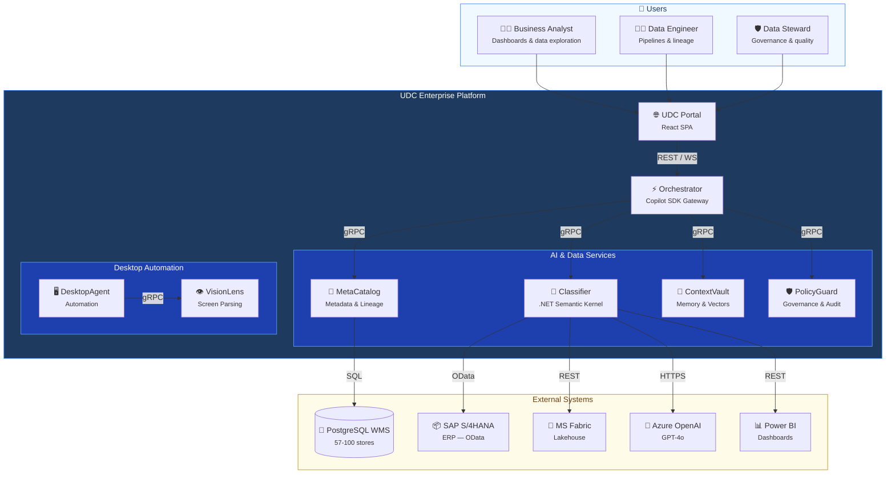
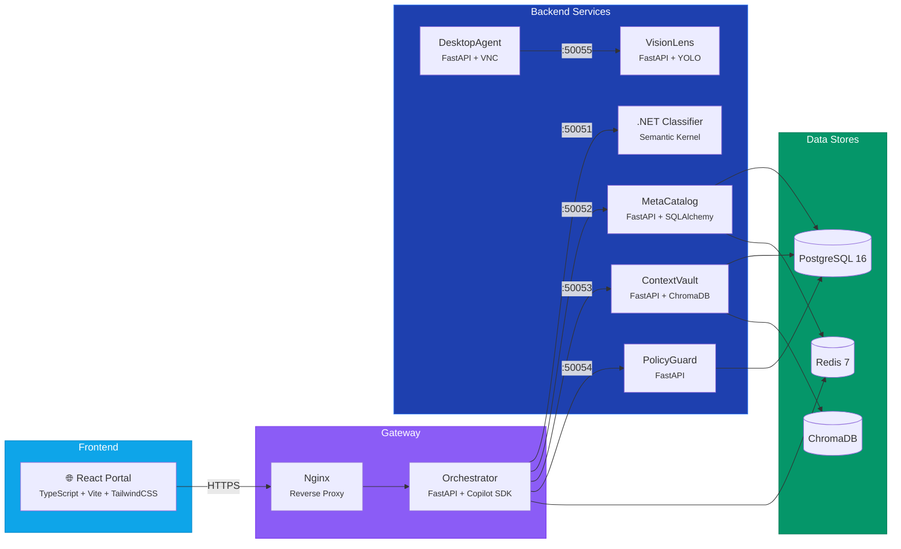
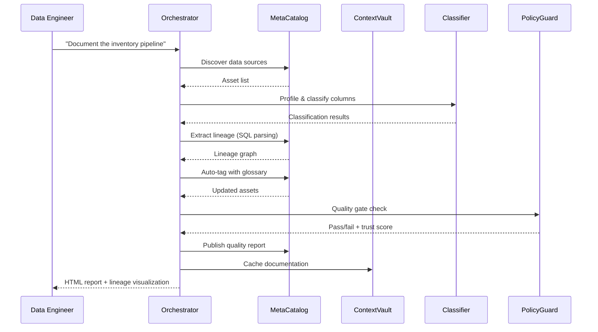
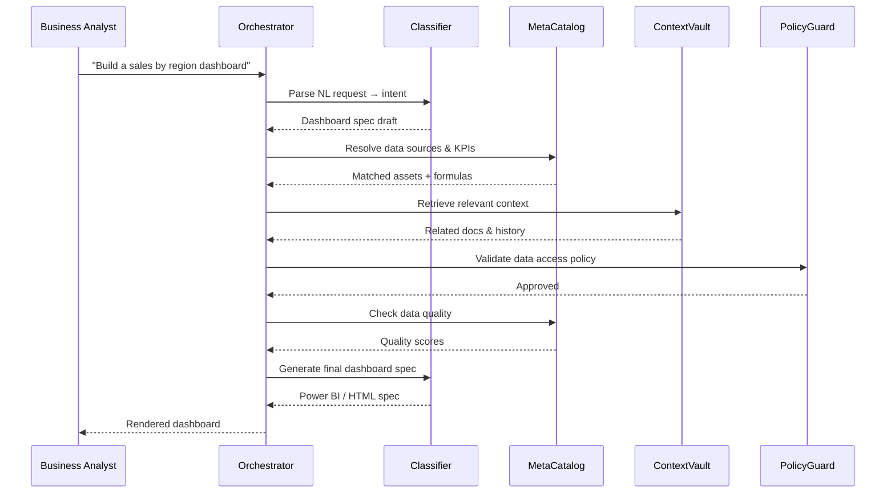

# UDC Enterprise Platform — Architecture

## System Context

The UDC Enterprise Platform is a modular monorepo consisting of **6 integrated subsystems** designed for enterprise retail data management. It targets organizations running 57–100 stores with PostgreSQL-based WMS, SAP S/4HANA ERP, and Microsoft Fabric Lakehouse.

## Container Diagram

## Subsystem Descriptions

### 1. UDC Classifier (.NET 8 / Semantic Kernel)
AI agent for data classification. Uses Semantic Kernel to orchestrate skills for profiling, schema inference, lineage tracking, and dashboard generation. Agents: ClassifierAgent, PipelineDocAgent, DashboardBuilderAgent, QualityGateAgent.

### 2. UDC MetaCatalog (Python / FastAPI)
Central metadata repository. Manages data assets, column profiles, lineage graphs, business glossary terms, KPI formulas, and quality reports. Provides ingesters for PostgreSQL, SAP, and Fabric sources.

### 3. UDC ContextVault (Python / FastAPI)
Three-layer context management: L0 (raw documents), L1 (curated chunks), L2 (synthesized summaries). Uses ChromaDB for vector search, Redis for caching, addressable via `vault://` URIs.

### 4. UDC VisionLens (Python / FastAPI)
Screen understanding pipeline: YOLO element detection → Azure AI Vision OCR → VLM captioning → NL grounding. Processes desktop screenshots for the Desktop Agent.

### 5. UDC DesktopAgent (Python / FastAPI)
Autonomous desktop automation using Perceive-Plan-Act-Reflect loop. Operates via VNC bridge in containerized Ubuntu+LXDE environment. Supports Chrome, LibreOffice, SAP GUI.

### 6. UDC PolicyGuard (Python / FastAPI)
Governance engine with deterministic policy evaluation (<1ms), trust scoring (0–1000), sandboxed preview, and append-only audit logging. Evaluates all actions before execution.

## Communication Patterns

| Pattern | Protocol | Use |
|---------|----------|-----|
| Synchronous internal | gRPC (Protobuf) | Service-to-service calls |
| Synchronous external | REST (OpenAPI 3.1) | Portal → Orchestrator |
| Async events | Redis Pub/Sub | Asset registration, quality reports |
| Streaming | SSE (Server-Sent Events) | Chat responses to portal |
| Desktop control | WebSocket | Real-time desktop agent feedback |

## Data Flow: Use Case 2 — Pipeline Documentation

## Data Flow: Use Case 4 — Dashboard Builder

